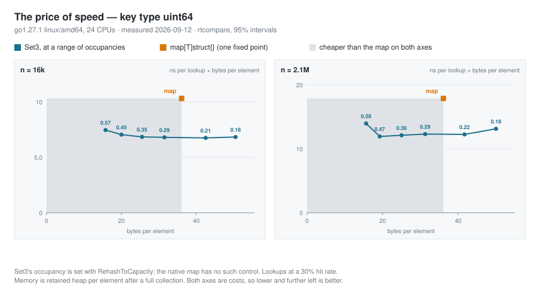
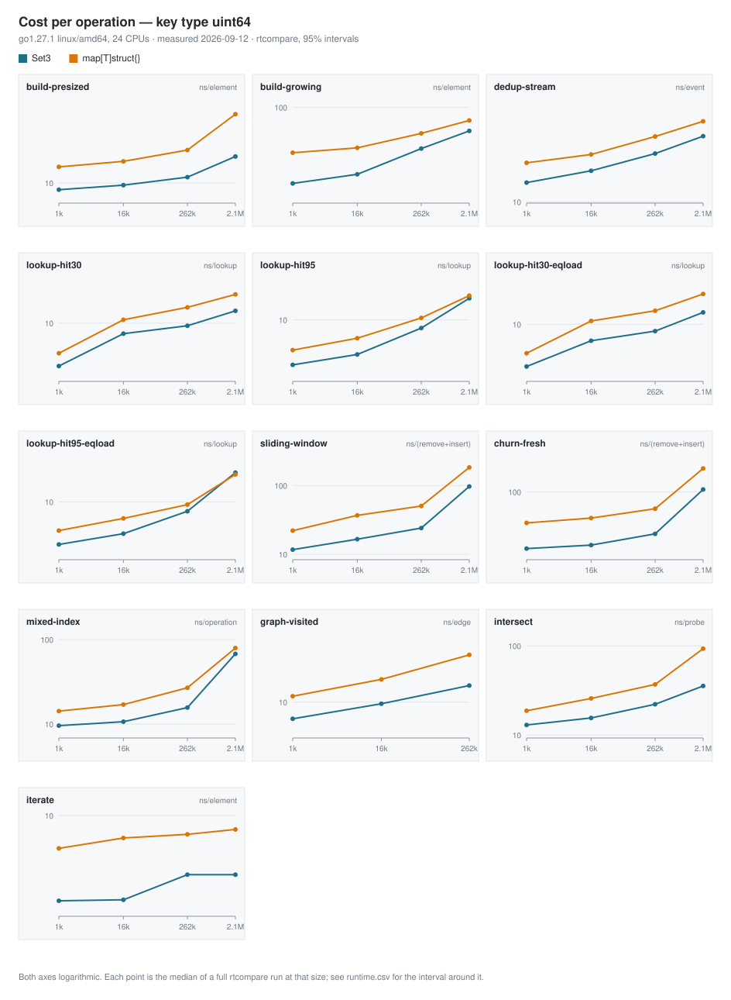
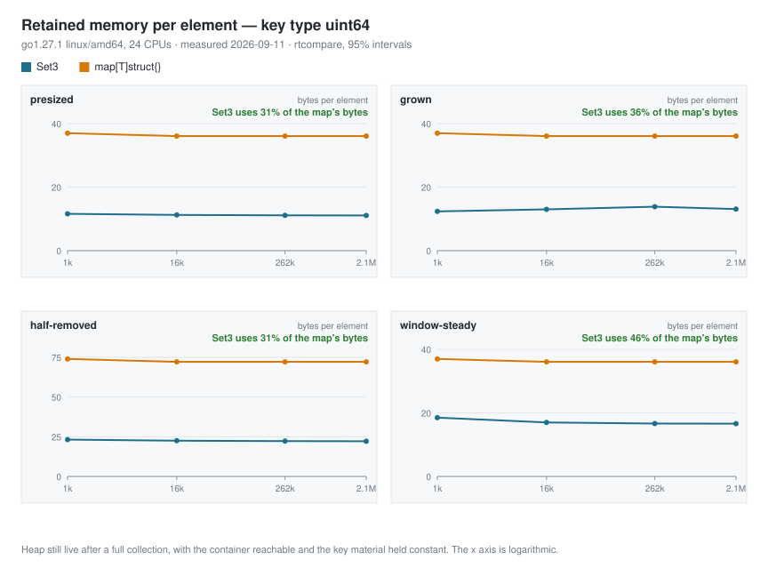

# Set3

[](https://pkg.go.dev/github.com/TomTonic/Set3)
[](https://github.com/TomTonic/Set3/actions/workflows/lint.yml)
[](https://github.com/TomTonic/Set3/actions/workflows/coverage.yml)

[](https://www.bestpractices.dev/projects/9470)
[](https://scorecard.dev/viewer/?uri=github.com/TomTonic/Set3)

Set3 is a high-performance, native Golang set implementation built on the Abseil "Swiss table" layout rather than on
`map[type]struct{}`, the standard foundation for most Go set implementations.

Out of the box it holds about a third of the native map's bytes and is decisively faster at building, iterating, set algebra and
churn — iteration is three to four times faster — while being *slower* at plain membership lookups. That is not an accident of
implementation: Set3 fills its table to about 83% where the native map stops near 47%, which buys memory and pays in probe
length. Unlike a map, Set3 lets you move that operating point with `RehashToCapacity(newCapacity)`, and at roughly half the
map's memory it is both smaller and faster than the map on every axis measured. The [Performance](#performance) section shows
the whole curve, one workload at a time, each number with its confidence interval and the machine's own noise floor beside it.

The code is derived from [SwissMap](https://github.com/dolthub/swiss) and it implements the "Fast, Efficient, Cache-friendly Hash Table" found in [Abseil](https://abseil.io/blog/20180927-swisstables).
For details on the algorithm see the [CppCon 2017 talk by Matt Kulukundis](https://www.youtube.com/watch?v=ncHmEUmJZf4).
The dependency on x86 assembler for [SSE2/SSE3](https://en.wikipedia.org/wiki/Streaming_SIMD_Extensions) instructions has been removed for portability and speed; the code runs faster without SSE and the necessary additional stack frame.
Hashing is done by the [`hashing`](hashing) package, which picks a hash function per element type when a set is created and falls back to Go's own `hash/maphash` for types it has no specialised routine for.

The name "Set3" comes from the fact that this was the 3rd attempt for an optimized datastructure/code-layout to get the best runtime performance.

## Installation

To use the `Set3` package in your Go project, follow these steps:

1. **Initialize a Go module** (if you haven't already):

   ```sh
   go mod init your-module-name
   ```

2. **Add the package**: Simply import the package in your Go code, and Go modules will handle the rest:

   ```go
   import "github.com/TomTonic/Set3"
   ```

3. **Download dependencies**: Run the following command to download the dependencies:

   ```sh
   go mod tidy
   ```

   This will automatically download and install the Set3 package along with any other dependencies.

## Using Set3

The following test case creates two sets and demonstrates some operations. For a full list of operations on the `Set3` type, see [API doc](https://pkg.go.dev/github.com/TomTonic/Set3#Set3).

```go
func TestExample(t *testing.T) {
    // create a new Set3
    set1 := Empty[int]()
    // add some elements
    set1.Add(1)
    set1.Add(2)
    set1.Add(3)
    // add some more elements
    set1.AddAllOf(4, 5, 6)
    // create a second set directly from an array
    set2 := FromArray([]int{2, 3, 4, 5})
    // check if set2 is a subset of set1. must be true in this case
    isSubset := set1.ContainsAll(set2)
    assert.True(t, isSubset, "%v is not a subset of %v", set2, set1)
    // mathematical operations like Unite, Subtract and Intersect
    // do not manipulate a Set3 but return a new set
    intersect := set1.Intersect(set2)
    // compare sets. as set2 is a subset of set1, intersect must be equal to set2
    equal := intersect.Equals(set2)
    assert.True(t, equal, "%v is not equal to %v", intersect, set2)
}
```

## Repository layout

```text
set3.go            the library — the Set3 type and every operation on it
hashing/           hash function selection and the per-type hash routines
internal/prime/    the primality search that sizes the control table
lab/               experiments and long-running measurements (see lab/README.md)
```

Everything under `lab/` is compiled out by default. It carries the `set3lab`
build tag, so `go build ./...` and `go test ./...` do not see it at all:

```sh
go test ./...                          # the library — seconds
go test -tags set3lab -short ./lab/... # the experiments too — minutes
```

The linter is configured with the tag on, so the experiment code is still
checked on every run and cannot rot unnoticed. `lab/README.md` explains what
lives there and how to run each suite for real.

## Performance

Set3 is measured against `map[T]struct{}` by the suite in
[`lab/setcompare`](lab/setcompare): twelve workloads, four key types, and set
sizes from a thousand elements to two million by default, or to eight million
with `SET3_CMP_HUGE=1`. Six of the workloads are shaped
after something a program actually does with a set — a membership filter on a
request path, a deduplication window with an expiry, a live index under churn,
the visited set of a graph traversal, an inverted-index intersection, a flush
that walks every element. The other four isolate one cost each, because a
realistic workload that mixes four costs cannot tell you which of them moved,
and two repeat the membership workloads with Set3 rehashed to the native map's
occupancy, so that the space/time trade is held fixed and the layouts are
compared on their own.

Every number comes with the evidence for it. The suite runs the full
[rtcompare](https://github.com/TomTonic/rtcompare/blob/main/HOWTO.md) protocol:
batches sized so the clock contributes a bounded error, each candidate run
against *itself* first to find out what this machine reports as a difference
when there provably is none, the two candidates then measured interleaved,
each series tested for a trend across the run, and correlated samples resampled
in blocks. A result that does not clear both zero and that noise floor is
reported as **unresolved** rather than as a small win, and such cells are drawn
in the charts rather than dropped.

```sh
go test -tags set3lab -run TestCompareSuite -v -count=1 -timeout 180m ./lab/setcompare
go run  -tags set3lab ./lab/cmd/setchart -in lab/results/setcompare
```

The measurement takes about ninety minutes; drawing takes an instant. It writes
`lab/results/setcompare/` as CSV, with a `run.txt` naming the machine and the
configuration, and the chart tool turns those into the SVGs below. See
[lab/README.md](lab/README.md) for the knobs.

Read the machine's own verdict on itself before reading any result: `run.txt`
and the `note` column record the noise floor, the cells that drifted, and the
rate at which the setup reported a difference between two runs of *identical*
code. A run whose warnings mention a false-signal rate well above 10% was taken
on a machine that was not holding still, and its magnitudes should not be
quoted.

### Set3 is a curve; a map is a point

This is the measurement that frames all the others. Both axes are costs, so
down and left is better, and the shaded region is everything cheaper than the
native map *on both axes at once*. Each Set3 point is labelled with the
occupancy that produced it.



Read at 16 384 `uint64` elements, 30% hit rate:

| operating point | bytes/element | ns/lookup | vs. the map |
| --- | --- | --- | --- |
| `map[uint64]struct{}` | 36.1 | 10.56 | — |
| Set3 at 0.76 load — **as shipped** | 11.8 | 11.74 | −10.2% |
| Set3 at 0.61 load | 14.7 | 8.41 | **+20.4%** |
| Set3 at 0.47 load | 19.0 | 7.30 | **+30.7%** |
| Set3 at 0.37 load | 24.0 | 6.98 | **+33.7%** |
| Set3 at 0.24 load | 37.5 | 6.92 | +34.5% |

Three things follow, and none of them is visible in a single-number comparison.

**Set3's default sits past the knee of its own curve.** Filling to 83% is what
makes it a third of the map's size, and it costs 10% on lookups against the
map. One rehash to about 60% occupancy — still 41% of the map's memory — turns
that into a 20% win.

**The curve saturates around 0.40.** Going from 24 to 37.5 bytes per element
buys 0.05 ns. There is no reason to spend past the knee.

**Past the knee it can reverse.** At two million elements the curve is
U-shaped: it peaks at +37.0% around 0.39 occupancy and falls back to +28.1% at
0.24, because by then the table no longer fits where it did. The optimum
occupancy is a function of your working set, which is exactly why the knob
exists and why the chart is a curve rather than a recommendation.

So the actionable advice is short: **if your workload is lookup-heavy, give
Set3 about twice the capacity you need.** If it is memory-constrained, leave it
alone and take the 3× saving.

### Workload by workload

Positive means Set3 is faster. The whisker is the 95% confidence interval, the
pale band is the noise floor, and a grey bar established nothing. Set3 is at
its default occupancy here except in the `-eqload` rows, which repeat the
membership workloads with it rehashed to the map's.

![Set3 vs map[uint64]struct{}](lab/results/setcompare/speedup-uint64.svg)

Where Set3 wins it usually wins by a lot, and for reasons that have nothing to
do with the load factor:

| Workload | `uint64` | `string` | `struct3x64` |
| --- | --- | --- | --- |
| `iterate` | +68 … +77% | +61 … +71% | +65 … +72% |
| `build-presized` | +38 … +69% | +25 … +61% | +47 … +71% |
| `intersect` | +38 … +65% | +10 … +40% | — |
| `sliding-window` | +33 … +48% | +22 … +36% | — |
| `graph-visited` | +26 … +40% | — | — |
| `dedup-stream` | +21 … +36% | −9 … 0% | +19 … +44% |
| `lookup-hit30` | −22 … +2% | −39 … −14% | −34 … +22% |
| `lookup-hit30-eqload` | **+20 … +34%** | −13 … +8% | −9 … +16% |

Iteration is the largest and most durable difference: Set3 scans its groups
linearly, the native map walks buckets from a randomised start, and at two
million elements that is 2.31 ns against 9.87 ns per element. Building a
presized set of two million is 17.68 ns against 56.72 ns per element — most of
which is not hashing but touching a third as much memory.

The lookup rows are the load factor, and the `-eqload` rows are the same
workload with it held fixed: `uint64` goes from −22 … +2% to +20 … +34%.

![Set3 vs map[string]struct{}](lab/results/setcompare/speedup-string.svg)

String keys are Set3's weakest case even at matched occupancy. About half the
cost of a small-set string lookup is the hash itself (3.9 ns of 7.6), and
`BenchmarkStringHashRoutes` in the suite puts the routine these charts were
measured with at 3.93 ns against the runtime's 3.55 ns for a 20-byte key. That
gap is small; what dominated it was a serial dependency chain of widening
multiplies — an N-word key cost 2N multiplies that the processor could not
overlap, because each one needed the previous one's result.

That chain is gone. The byte routines are now a specialization of
`memHashFallback` from the Go runtime's own map hasher — the Go authors'
adaptation of [wyhash](https://github.com/wangyi-fudan/wyhash) — which consumes
words in independent lanes and closes with two mixing steps instead of one per
word. Set3 specializes it to native endianness, derives its four secret words
from the per-set seed instead of a process-global random array, and pins the hot
fixed key sizes to straight-line entry points.

Measured as latency, where nothing can overlap: a 16-byte key falls from 6.34 ns
to 2.54, a 24-byte struct key from 8.44 to 3.51, a 32-byte one from 10.51 to
3.40, a 24-byte string from 10.59 to 5.49 and a 64-byte string from 20.69 to
6.43. `lab/hashperf` keeps the superseded routine runnable as the baseline, so
the comparison stays checkable.

Quality is not argued from the speedup. `lab/hashquality/smhasher_test.go` is the
Go authors' port of [SMHasher](https://github.com/aappleby/smhasher) retargeted
onto this package — sanity, appended zeros, small keys, all-zero lengths, two
nonzero bytes, cyclic repeats, sparse bit patterns, block permutations, windowed
rotations, text, avalanche and seed sensitivity, all measured against a collision
bound derived from the birthday paradox. The `hashing` package carries its own
structural tests on top of that, including one that pins the read window to
exactly the key and one that holds each fixed-size entry point equal to the
generic path.

The charts above were measured after that change.

![Set3 vs map[struct]struct{}](lab/results/setcompare/speedup-struct3x64.svg)

### What it costs

The percentages say who won. These say what it cost, which is what decides
whether a percentage is worth anything. Both axes are logarithmic.



### Memory

Set3 holds between 31% and 64% of the native map's bytes, depending on the key
type and on how the container was filled. This is measured as heap still live
after a full collection with the container reachable — not as anything either
container reports about itself — and the measurement is calibrated against a
`[]uint64` of known size on every run.



| Fill history | `Set3[uint64]` | `map[uint64]struct{}` | ratio |
| --- | --- | --- | --- |
| created at the right capacity | 11.1 B/elem | 36.1 B/elem | **0.31×** |
| grown from empty | 13.1 B/elem | 36.1 B/elem | **0.36×** |
| filled, then half removed | 22.2 B/elem | 72.2 B/elem | **0.31×** |
| a sliding window after 4× its size in churn | 16.6 B/elem | 36.1 B/elem | **0.46×** |

Two mechanisms account for all of the difference, and both are properties of
the Go runtime rather than of anyone's benchmark:

1. **A `struct{}` value is not free.** The native map's slot is a struct of key
   and element, and Go pads a struct whose last field is zero-sized so that a
   pointer one past the end cannot escape the object. `struct{uint64; struct{}}`
   therefore occupies 16 bytes — exactly as much as `struct{uint64; uint64}`,
   which is why a `map[uint64]struct{}` and a `map[uint64]uint64` measure
   identically here. With eight control bytes per group of eight slots, the
   native map pays 17 bytes per slot. Set3 stores the keys themselves in a
   `[8]T` array with one 64-bit control word beside it, and pays 9.
2. **The occupancy differs.** At 17 bytes per slot, 36 bytes per element works
   out to 2.12 slots per element, so the map runs about 47% full. Set3 runs to
   its limit of 6.67 slots in 8, which is 83%.

Nine bytes per slot at 83% against seventeen at 47% is the whole of it. Note
what that is *not*: it is not waste. A lower load factor buys shorter probe
sequences, and the native map spends memory on exactly that — which is what
[the curve above](#set3-is-a-curve-a-map-is-a-point) is measuring. The two
mechanisms are separable: the padded slot is worth a factor of about 1.9
whatever the occupancy, so even at an identical load factor Set3 holds roughly
53% of the bytes. Only the rest is the tuning.

The `window-steady` row costs 0.46 of the map's bytes against `presized`'s
0.31, and that gap is not tombstones. It is one growth: the shape starts from
`EmptyWithCapacity(size)`, which leaves the table at 98% of its limit, and a
window needs free slots to keep probing short. One growth to 54% occupancy is
the whole of the difference, and it is stable from the first window turn
onwards.

There *is* a tombstone defect, it has been fixed, and this measurement does not
show it — which is worth saying plainly, because the two were confused during
the investigation. The insert path used to grow the table whenever `resident`
reached the limit, and `resident` counts every slot that is not empty,
tombstones included. `Remove` can clear a slot outright only when its group has
an empty slot to terminate probes with, and in a full table it usually does not;
it leaves a tombstone instead. `Add` reuses a tombstone only when one happens to
lie on the probe path of the element being inserted.

Whether that drifts depends on where the new keys come from, and the difference
is stark. Measured at 262 144 `uint64` keys over twenty window turns:

| key source | before | after |
| ---------- | ------ | ----- |
| a ring of `2n` keys cycled through | 16.62 B/element, 54% full | 16.62 B/element, 54% full |
| fresh keys, never repeating | 24.94 B/element, 36% full, 204 122 tombstones | 16.62 B/element, 54% full, 53 034 tombstones |

A re-inserted key hashes to the home group it had before and very often lands on
its own tombstone, so a cyclic window reuses tombstones almost perfectly and
never drifts. A cache, a work queue, or a deduplicator over a live stream sees
keys it has never seen, each probing from a fresh home group, and those keys
reuse a tombstone only by luck. That is the case that grew the table 2.25× while
holding a constant number of elements.

`Add` now asks which kind of pressure it is under. If the live element count is
still at or below three quarters of the limit, the table is full of tombstones
rather than elements, and one rehash at the *same* size gives every one of those
slots back. Only a table genuinely full of elements grows. The three quarters is
a knob and points the other way from the load factor: a smaller fraction grows
more readily and settles lower, which is faster and larger. Abseil draws the
same line at 25/32.

The suite does not currently have a fresh-key churn scenario — `sliding-window`
cycles a ring, so it measures the cyclic column above and cannot see this at
all. That is a gap in the suite rather than a property of the library, and it is
why the fix is pinned by tests in `set3_tombstone_test.go` rather than by a row
in these tables.

Note also that these figures moved with Go itself. On the bucket map that this
README's original 25% figure was taken on, `map[uint64]struct{}` cost about 12
bytes per element; the Swiss-table rewrite in Go 1.24 tripled it. The suite
carries that as an executable note — `TestNativeMapFootprintIsWhatWeMeasure`
fails if the runtime's representation changes again.

### Profile-Guided Optimization

`Set3` picks its hash function once, when the set is created, and stores it as a
function value. Calling it is therefore an indirect call that the compiler
cannot resolve on its own, and for small keys that call is a noticeable part of
the work: hashing a `uint64` costs about 1 ns, the indirect call about 0.8 ns on
top.

[Profile-guided optimization](https://go.dev/doc/pgo) removes it. With a profile
that covers the hot path, the compiler replaces the indirect call with a guarded
direct call, which is then inlinable:

```text
./hashing/hasher.go:41:13: PGO devirtualizing function call hashing.h.fn to hashing.HashI64WHdet
```

On Go 1.27 it now devirtualizes the string and raw-block routines as well:

```text
./hashing/hasher.go:54:13: PGO devirtualizing function call hashing.h.fn to hashing.HashI64WHdet
./hashing/hasher.go:54:13: PGO devirtualizing function call hashing.h.fn to hashing.HashString
./hashing/bytehash.go:36:21: PGO devirtualizing function call hashing.specialized to hashing.hashByteBlock24
```

What that is worth was measured by running the whole comparison suite twice,
once built without a profile and once with one, on the same quiet machine
(AMD Ryzen 9 7900, Go 1.27.1, 1h22m per run). PGO is a property of the build, so
this is the one comparison here that cannot be interleaved; what *is* interleaved
is Set3 against the map inside each run, and the table below reports how that
paired advantage moved between the two builds. Both candidates share a run's
machine conditions, which is what makes the comparison survive the difference
between one evening and the next.

| Scenario              | cells | change in Set3's advantage |
| --------------------- | ----- | -------------------------- |
| `lookup-hit95`        | 7     | +4.3pp                     |
| `mixed-index`         | 8     | +3.0pp                     |
| `lookup-hit30`        | 9     | +2.8pp                     |
| `dedup-stream`        | 11    | +2.4pp                     |
| `build-presized`      | 12    | +2.0pp                     |
| `sliding-window`      | 8     | +0.5pp                     |
| `build-growing`       | 8     | -0.3pp                     |
| `intersect`           | 8     | -2.6pp                     |
| **all of the above**  | 92    | **+1.6pp**                 |

The absolute nanoseconds agree with the paired figure from the other side: over
the same cells PGO made Set3 1.9% faster and the map 0.4%, which is the same
1.5pp of relative gain seen above. That is a smaller number than a
microbenchmark of `Contains` alone would give, and both are true — a lookup in a
real scenario does more than hash, so removing one indirect call is a smaller
share of it.

`iterate` is excluded from the table and from the totals. It reports -12.2pp,
and the cause is the suite rather than the library: under this profile the
benchmark's own accumulator escapes to the heap, because the batch is a closure
stored in a struct and called indirectly. Compiling a plain
`for e := range s.MutableRange()` loop in an ordinary consumer against the same
profile shows identical escape analysis with and without PGO, so this is a
measurement artifact and not something a caller would meet. It is left in the
CSV with this note rather than quietly dropped.

PGO removes the indirect call itself. The call *frame* around it is a separate
matter and is already gone: `RuntimeHasher.Hash` is written as a single
expression so that its inline cost stays inside the compiler's budget and it
gets inlined into `Contains`, `Add` and `Remove`. See the note on `Hash` in
[`hashing/hasher.go`](hashing/hasher.go) before reformatting it.

PGO is applied by the binary being built, not by this library, so the win is
yours to collect: record a CPU profile of your application under a realistic
load, drop it in your main package as `default.pgo`, and rebuild. Nothing in
`Set3` needs to change.

### Earlier measurements (v0.4.0, Go 1.23)

The charts below predate the suite above. They were produced with
[v0.4.0](https://github.com/TomTonic/Set3/releases/tag/v0.4.0) on Go 1.23.1
without PGO, by `lab/setbench`, and they cover a range the current suite does
not: every size from 1 to 300 elements, one at a time, where the constant costs
of allocating a container still dominate. Raw results are
[in plain text](lab/results/benchresult.txt); see
[lab/README.md](lab/README.md) for how to reproduce them.

#### Inserting Nodes into an Empty Set

The following chart illustrates the time required to insert random uint64 values into newly allocated sets.
The displayed times encompass the set allocation process.
All sets were allocated with an initial capacity of 21 elements, which is the current default in Set3.
As a result, rehashing occurs—sometimes multiple times—for larger sets.
This effect is clearly visible in the two charts below.

n = 1 ... 300 (step size +1, linear scale)


Please note that the memory chart displays the total memory consumption divided by the number of elements in the set.
This effectively represents the memory usage for storing a single element, i.e., 8 bytes.
Additionally, be aware of the lower bound of 10 bytes and the logarithmic scale of the y-axis.

n = 1 ... 300 (step size +1, linear scale)


#### Searching Nodes in a Populated Set

The following chart illustrates the time required to determine whether a random value is present in the set.
The test driver maintains a 30% hit ratio, ensuring that 30% of the queried values are contained within the set, while the remaining 70% are not.
The x-axis represents sets of varying sizes, and the y-axis indicates the average time taken to look up a random value in a set of the corresponding size.

n = 1 ... 300 (step size +1, linear scale)

